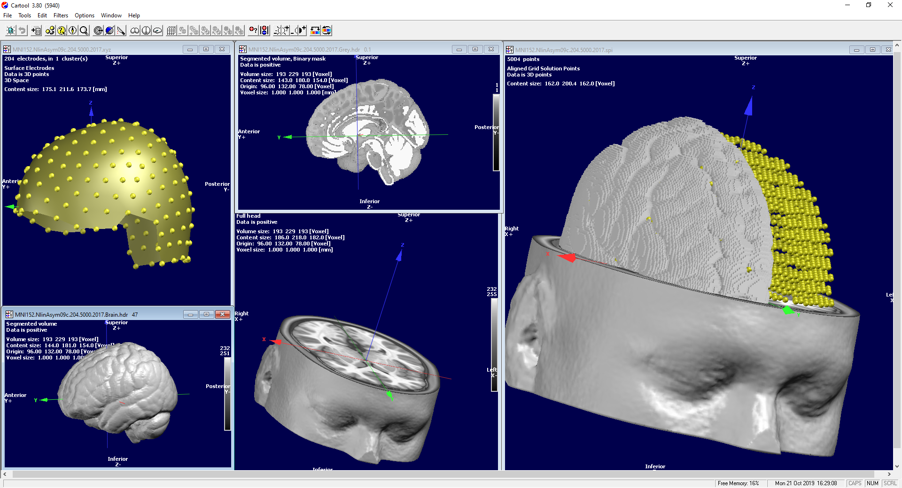

# PyCartool
A simple open source Python package for I/O between Cartool and python

## About Cartool
Cartool is the EEG analysis software developed at the Functional Brain Mapping Lab (FBMLab), in Geneva, Switzerland. This project was initiated in 1996, and is still actively developed up to these days. It has been entirely programmed by Denis Brunet in C++, and doesn't rely on any other dependency to run.
from [Cartool website](https://sites.google.com/site/cartoolcommunity/about).

## Installation

The latest stable version of Pycartool is available through [PyPi](https://pypi.org/project/pycartool/):

`pip install pycartool`

## Documentation

Documentation is available at <https://pycartool.readthedocs.io/en/stable/>

## Contributing to Pycartool

Any contribution is welcome, please let us know by opening an issue!
